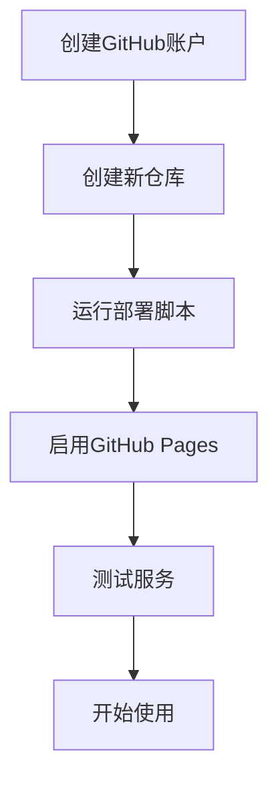

# GitHub 仓库设置指南

## 🚀 快速设置步骤

### 1. 创建GitHub仓库

1. **访问GitHub**：
   - 打开浏览器，访问 https://github.com
   - 登录你的GitHub账户

2. **创建新仓库**：
   - 点击右上角的 "+" 号
   - 选择 "New repository"

3. **填写仓库信息**：
   ```
   Repository name: api-key-pool-service
   Description: API Key Pool Service with load balancing and round-robin functionality
   Visibility: Public (推荐) 或 Private
   ```
   
   **重要**：不要勾选以下选项：
   - ❌ Add a README file
   - ❌ Add .gitignore
   - ❌ Choose a license

4. **创建仓库**：
   - 点击 "Create repository"

### 2. 获取仓库URL

创建完成后，你会看到类似这样的页面：
```
https://github.com/your-username/api-key-pool-service
```

记住这个URL，部署脚本会用到。

### 3. 运行部署脚本

现在你可以运行部署脚本了：

```powershell
# PowerShell (推荐)
.\deploy.ps1

# 或者批处理
.\deploy.bat
```

### 4. 启用GitHub Pages

部署完成后，需要启用GitHub Pages：

1. **进入仓库设置**：
   - 在你的仓库页面，点击 "Settings" 标签

2. **找到Pages选项**：
   - 在左侧菜单中找到 "Pages"

3. **配置Pages**：
   - Source: 选择 "Deploy from a branch"
   - Branch: 选择 "main"
   - Folder: 选择 "/ (root)"
   - 点击 "Save"

4. **等待部署**：
   - GitHub Pages 通常需要几分钟时间部署
   - 部署完成后，你会看到类似这样的地址：
     ```
     https://your-username.github.io/api-key-pool-service
     ```

## 📋 完整流程



## 🔧 故障排除

### 问题1：仓库名称已存在
**解决方案**：
- 选择不同的仓库名称，如 `my-api-key-pool-service`
- 或者删除现有的同名仓库

### 问题2：无法推送代码
**解决方案**：
- 检查GitHub账户设置
- 确认SSH密钥或Personal Access Token配置正确

### 问题3：GitHub Pages未显示
**解决方案**：
- 等待几分钟让部署完成
- 检查仓库设置中的Pages配置
- 查看Actions标签中的部署状态

## 📞 获取帮助

如果遇到问题：

1. **查看GitHub文档**：
   - https://docs.github.com/en/pages

2. **检查部署状态**：
   - 进入仓库的 "Actions" 标签
   - 查看最新的部署记录

3. **查看错误日志**：
   - 在 "Settings" > "Pages" 中查看部署日志

## 🎯 最佳实践

1. **仓库命名**：
   - 使用小写字母和连字符
   - 避免特殊字符

2. **权限设置**：
   - 如果是个人项目，选择 Public
   - 如果是公司项目，选择 Private

3. **分支管理**：
   - 使用 main 分支作为主分支
   - 定期备份重要代码

4. **文档维护**：
   - 保持 README.md 更新
   - 添加使用说明和示例

---

**🎉 完成这些步骤后，你就可以享受无限制的API调用服务了！** 